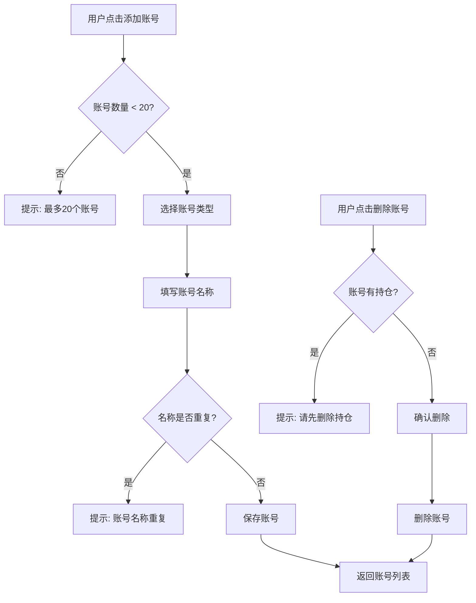
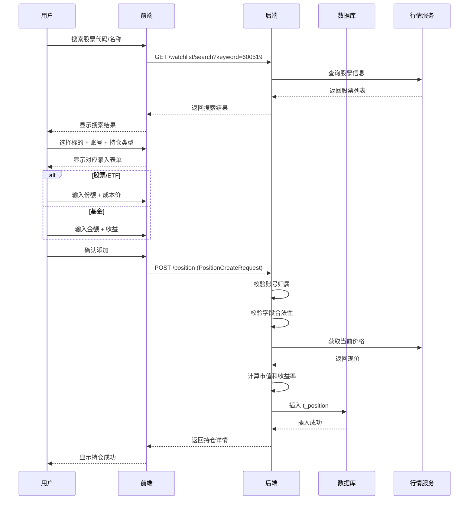
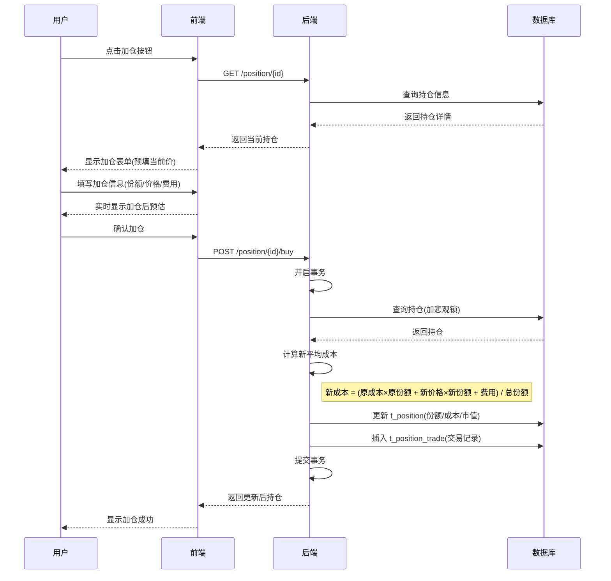
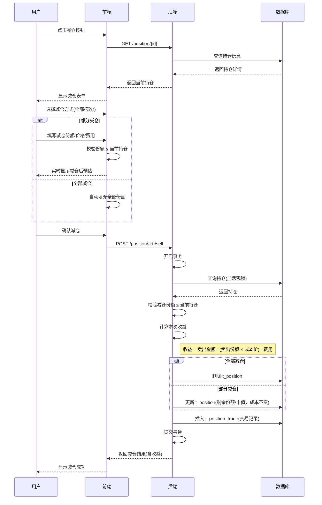
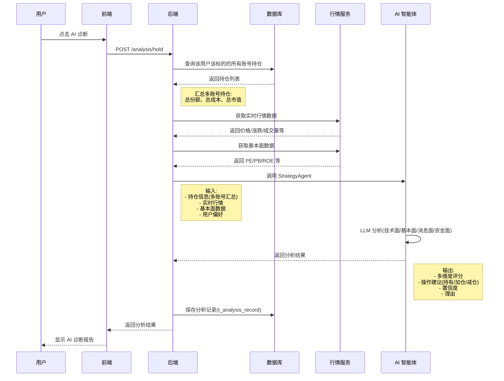
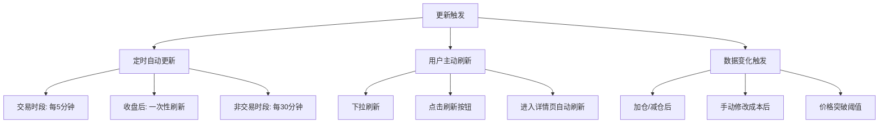
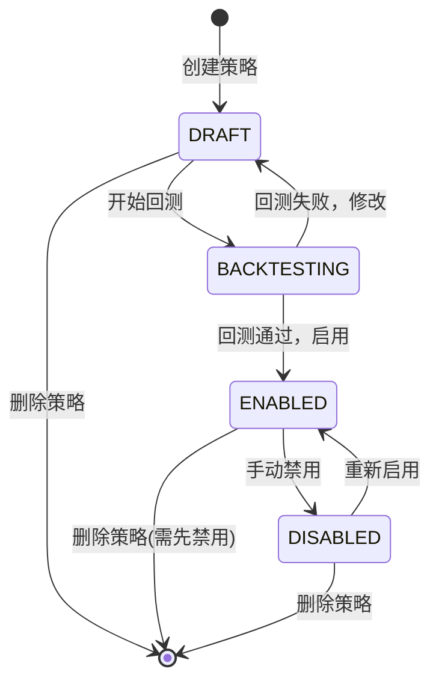
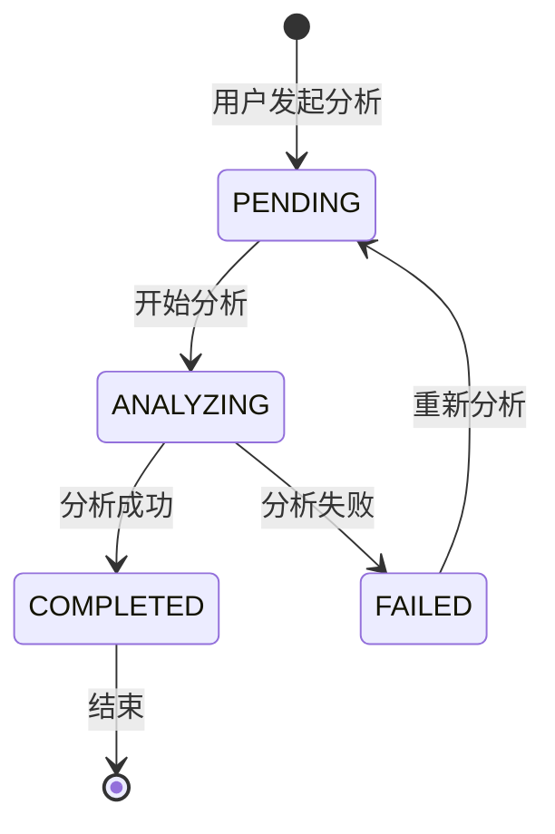

# 投资功能核心业务逻辑与流程

> 版本：v2.0
> 日期：2025-01-10

---

## 一、业务规则

### 1.1 账号类型规则

| 账号类型 | 枚举值 | 说明 | 典型场景 | 适用持仓类型 |
|----------|--------|------|----------|------------|
| 券商 | BROKER | 券商平台账号 | 股票、场内ETF | STOCK, ETF |
| 基金平台 | FUND_PLATFORM | 基金销售平台 | 场外基金 | FUND |
| 支付宝 | ALIPAY | 支付宝理财 | 基金、理财 | FUND |
| 银行 | BANK | 银行账号 | 银行理财 | FUND |
| 其他 | OTHER | 其他平台 | 雪球、东方财富等 | STOCK, ETF, FUND |

**业务约束**：
- 每个用户最多创建 20 个账号
- 账号名称不能重复（同一用户下）
- 删除账号前必须先删除该账号下的所有持仓

### 1.2 持仓类型与录入规则

| 持仓类型 | 枚举值 | 适用市场 | 录入字段 | 市值计算 | 成本价计算 |
|---------|--------|---------|---------|---------|----------|
| 股票 | STOCK | A股/港股/美股 | 份额 + 成本价 | 份额 × 现价 | 平均成本价 |
| ETF | ETF | 场内基金 | 份额 + 成本价 | 份额 × 现价 | 平均成本价 |
| 基金 | FUND | 场外基金 | 金额 + 收益 | 金额 + 收益 | 不适用 |

**业务约束**：
- 股票/ETF：份额必须 > 0，成本价必须 > 0
- 基金：金额必须 > 0，收益可为负数
- 同一标的可以在多个账号持仓（例如：贵州茅台同时在东方财富和支付宝持有）

### 1.3 成本计算规则

#### 1.3.1 加仓后平均成本

**公式**：
```
新平均成本 = (原份额 × 原成本价 + 新份额 × 新价格 + 交易费用) / (原份额 + 新份额)
```

**示例**：
```
原持仓：100 股 × ¥168.00 = ¥16,800
加仓：50 股 × ¥182.00 = ¥9,100
费用：¥25
---------------------------------------
新持仓：150 股
新成本：(¥16,800 + ¥9,100 + ¥25) / 150 = ¥172.83
```

#### 1.3.2 减仓后成本

**规则**：
- 减仓不影响剩余持仓的平均成本价
- 仅更新剩余份额和市值
- 记录本次交易的收益

**示例**：
```
原持仓：150 股 × ¥172.83 = ¥25,924.50
减仓：30 股 × ¥190.00 = ¥5,700
费用：¥20
---------------------------------------
剩余持仓：120 股
剩余成本：¥172.83（不变）
本次收益：¥5,700 - (30 × ¥172.83) - ¥20 = +¥495.10
```

#### 1.3.3 基金持仓

**规则**：
- 基金没有"成本价"概念
- 用户手动更新"金额"和"收益"
- 收益率 = 收益 / 金额

**示例**：
```
持仓金额：¥50,000
持仓收益：+¥5,200
收益率：+¥5,200 / ¥50,000 = +10.4%
```

### 1.4 置信度规则

| 置信度区间 | 含义 | 建议操作 | 视觉标识 |
|-----------|------|----------|---------|
| 90-100% | 信号明确 | 重点关注，可适当加大仓位 | 🟢 绿色 |
| 70-89% | 信号较强 | 建议关注，正常仓位 | 🟡 黄色 |
| 50-69% | 信号中性 | 仅供参考，需结合其他信息 | 🟠 橙色 |
| 30-49% | 信号较弱 | 谨慎操作，小仓位试探 | 🔴 红色 |
| < 30% | 信号不明确 | 建议观望 | ⚫ 灰色 |

**置信度计算方法**：
```
置信度 = (技术面评分 × 0.3) + (基本面评分 × 0.3) + (消息面评分 × 0.2) + (资金面评分 × 0.2)
```

### 1.5 仓位控制规则

| 风险承受能力 | 单只股票最大仓位 | 单一板块最大仓位 | 股票总仓位 |
|-------------|----------------|----------------|----------|
| 保守型 | 10% | 20% | 50% |
| 稳健型 | 15% | 30% | 70% |
| 激进型 | 20% | 40% | 100% |

**业务约束**：
- AI 分析建议不超过用户风险承受能力对应的仓位上限
- 系统自动计算当前持仓占比，超过阈值时提示风险

---

## 二、核心业务流程

### 2.1 账号管理流程



### 2.2 持仓录入流程



### 2.3 加仓流程



### 2.4 减仓流程



### 2.5 AI 持仓分析流程



---

## 三、持仓收益自动更新机制

### 3.1 更新触发方式



### 3.2 更新计算逻辑

#### 3.2.1 股票/ETF 收益计算

```java
// 伪代码
public void updateStockPosition(Position position) {
    // 1. 获取最新价格
    BigDecimal currentPrice = marketDataService.getLatestPrice(position.getSymbol());

    // 2. 计算市值
    BigDecimal currentValue = position.getShares().multiply(currentPrice);

    // 3. 计算成本总额
    BigDecimal totalCost = position.getShares().multiply(position.getAvgCost());

    // 4. 计算收益
    BigDecimal profit = currentValue.subtract(totalCost);

    // 5. 计算收益率
    BigDecimal profitRate = profit.divide(totalCost, 4, RoundingMode.HALF_UP);

    // 6. 更新持仓
    position.setCurrentPrice(currentPrice);
    position.setCurrentValue(currentValue);
    position.setProfitRate(profitRate);
    position.setUpdatedAt(LocalDateTime.now());

    positionRepository.save(position);
}
```

#### 3.2.2 基金收益计算

```java
// 伪代码
public void updateFundPosition(Position position) {
    // 1. 获取最新净值（仅供参考展示）
    BigDecimal currentNav = marketDataService.getLatestNav(position.getSymbol());
    position.setCurrentPrice(currentNav);

    // 2. 基金市值 = 用户手动维护的金额 + 收益
    BigDecimal currentValue = position.getAmount().add(position.getProfit());

    // 3. 收益率 = 收益 / 金额
    BigDecimal profitRate = position.getProfit()
        .divide(position.getAmount(), 4, RoundingMode.HALF_UP);

    // 4. 更新持仓
    position.setCurrentValue(currentValue);
    position.setProfitRate(profitRate);
    position.setUpdatedAt(LocalDateTime.now());

    positionRepository.save(position);

    // 注意：基金的 amount 和 profit 需要用户手动更新
}
```

### 3.3 定时任务设计

```java
@Component
public class PositionUpdateScheduler {

    @Autowired
    private TradingDayService tradingDayService;

    @Autowired
    private PositionService positionService;

    // 交易时段：每 5 分钟刷新一次（9:30-15:00）
    @Scheduled(cron = "0 0/5 9-15 * * MON-FRI")
    @SchedulerLock(name = "updatePositionsDuringTrading",
                   lockAtLeastFor = "4m",
                   lockAtMostFor = "5m")
    public void updatePositionsDuringTrading() {
        // 判断是否为交易日
        if (!tradingDayService.isTradingDay(LocalDate.now())) {
            return;
        }

        // 分批处理：每批 100 个用户
        positionService.updateAllPositionsBatch(100);
    }

    // 收盘后：一次性刷新全部（15:30）
    @Scheduled(cron = "0 30 15 * * MON-FRI")
    @SchedulerLock(name = "updatePositionsAfterClose",
                   lockAtLeastFor = "10m",
                   lockAtMostFor = "30m")
    public void updatePositionsAfterClose() {
        if (!tradingDayService.isTradingDay(LocalDate.now())) {
            return;
        }

        // 使用收盘价更新所有持仓
        positionService.updateAllPositionsAfterClose();
    }

    // 非交易时段：每 30 分钟刷新一次
    @Scheduled(cron = "0 0/30 0-9,15-23 * * *")
    public void updatePositionsNonTrading() {
        // 只更新有持仓的活跃用户（最近 7 天有登录）
        positionService.updateActiveUsersPositions();
    }
}
```

### 3.4 手动更新入口

| 入口 | 说明 | 实现方式 |
|------|------|----------|
| 下拉刷新 | 持仓列表下拉刷新 | 调用 `/position` 接口，后端判断缓存过期则更新 |
| 刷新按钮 | 持仓列表顶部刷新按钮 | 强制刷新，忽略缓存 |
| 详情页自动刷新 | 进入持仓详情页 | 自动调用更新接口 |
| 基金收益编辑 | 基金持仓编辑金额/收益 | 用户手动输入，保存后重新计算 |

---

## 四、数据流转

### 4.1 账号数据流

```
用户添加账号
  ↓
t_account（账号表）
  ├── is_hidden 控制显示/隐藏
  ├── sort_order 控制排序
  └── is_active 控制启用/禁用

持仓录入时关联账号
  ↓
t_position.account_id → t_account.id

查询持仓列表
  ↓
WHERE account_id = ? （单账号查询）
WHERE user_id = ?   （全账号查询，可按标的汇总）
```

### 4.2 持仓数据流

```
【录入持仓】
用户输入 → 校验 → t_position（持仓表）
  ├── account_id 关联账号
  ├── shares/avg_cost（股票/ETF）
  └── amount/profit（基金）

【加仓操作】
用户加仓 → 计算新成本 → 更新 t_position
                  ↓
            t_position_trade（交易记录）
            ├── trade_type = BUY
            ├── account_id 关联账号
            └── 记录价格、份额、费用

【减仓操作】
用户减仓 → 计算本次收益 → 更新 t_position（剩余份额）
                    ↓
              t_position_trade（交易记录）
              ├── trade_type = SELL
              └── 记录价格、份额、费用、收益

【查询数据流】
查询持仓列表
  ↓
FROM t_position
WHERE user_id = ? AND (account_id = ? OR 全部账号)
  ↓
JOIN 行情服务获取最新价格
  ↓
计算实时市值和收益率
  ↓
返回前端
```

### 4.3 AI 分析数据流

```
用户请求 AI 分析（symbol + userId）
  ↓
【步骤1】查询持仓汇总
  ↓
SELECT * FROM t_position
WHERE user_id = ? AND symbol = ?
  ↓
汇总多账号持仓：
  - 总份额 = SUM(shares)
  - 加权平均成本 = SUM(shares × avg_cost) / SUM(shares)
  - 总市值 = SUM(current_value)

【步骤2】获取市场数据
  ↓
MarketDataService
  ├── 实时行情（价格、涨跌幅、成交量）
  ├── K线数据（日/周/月线）
  ├── 基本面数据（PE、PB、ROE、净利润增长率）
  └── 资金流向（主力资金、北向资金）

【步骤3】调用 AI 智能体
  ↓
StrategyAgent.analyze(
  positionSummary,  // 持仓汇总
  marketData,       // 市场数据
  userPreference    // 用户偏好（风险承受、投资目标）
)
  ↓
LLM 分析
  ├── 技术面评分（MA、MACD、RSI、布林带）
  ├── 基本面评分（估值、成长性、盈利能力）
  ├── 消息面评分（利好/利空消息）
  └── 资金面评分（资金流入/流出）
  ↓
输出：
  - 操作建议（持有/加仓/减仓）
  - 置信度（0-100%）
  - 多维度评分
  - 建议理由

【步骤4】保存分析记录
  ↓
INSERT INTO t_analysis_record
  ├── user_id
  ├── symbol
  ├── analysis_type = 'HOLD'
  ├── recommendation
  ├── confidence
  ├── analysis_result（JSONB，含多维度评分）
  └── created_at

【步骤5】返回前端
  ↓
AnalysisResponse
  ├── 持仓汇总（各账号持仓明细）
  ├── AI 分析结果
  └── 历史分析记录
```

---

## 五、状态机

### 5.1 策略状态流转



**状态说明**：
- **DRAFT**：草稿，可编辑、删除
- **BACKTESTING**：回测中，不可编辑
- **ENABLED**：已启用，系统自动监控并推送信号
- **DISABLED**：已禁用，不监控

### 5.2 分析记录状态



---

## 六、业务异常处理

### 6.1 并发操作冲突

**场景**：用户同时在两个设备操作同一持仓

**方案**：
```java
@Version
private Long version;  // 乐观锁字段

// 更新时检查 version
UPDATE t_position
SET shares = ?, avg_cost = ?, version = version + 1
WHERE id = ? AND version = ?

// 如果更新失败（version 不匹配），返回错误
if (updateCount == 0) {
    throw new OptimisticLockException("持仓已被其他操作修改，请刷新后重试");
}
```

### 6.2 账号归属校验失败

**场景**：用户尝试修改不属于自己的账号或持仓

**处理**：
```java
// 查询时强制加 user_id 条件
Position position = positionRepository.findByIdAndUserId(positionId, currentUserId);
if (position == null) {
    throw new ForbiddenException("无权限操作该持仓");
}
```

### 6.3 成本价异常

**场景**：用户输入的成本价远低于市场价（可能是错误输入）

**处理**：
```java
BigDecimal currentPrice = marketDataService.getLatestPrice(symbol);
BigDecimal avgCost = request.getAvgCost();

// 成本价 < 市场价 * 0.5，前端警告
if (avgCost.compareTo(currentPrice.multiply(BigDecimal.valueOf(0.5))) < 0) {
    return ApiResponse.warn("成本价远低于市场价，请确认是否正确");
}
```

### 6.4 减仓份额超限

**场景**：用户尝试减仓份额超过当前持仓

**处理**：
```java
if (sellShares.compareTo(position.getShares()) > 0) {
    throw new BusinessException("减仓份额不能超过当前持仓");
}
```

### 6.5 外部 API 超时

**场景**：获取行情数据超时

**处理**：
```java
@CircuitBreaker(name = "marketData", fallbackMethod = "getQuoteFromCache")
@Retry(name = "marketData", maxAttempts = 3)
@TimeLimiter(name = "marketData", timeout = 5, timeoutUnit = TimeUnit.SECONDS)
public QuoteData getQuote(String symbol) {
    return marketDataAdapter.getQuote(symbol);
}

// 降级：从缓存读取
public QuoteData getQuoteFromCache(String symbol, Exception e) {
    return redisService.get("quote:" + symbol);
}
```

### 6.6 LLM 分析失败

**场景**：AI 智能体调用失败或超时

**处理**：
```java
try {
    return strategyAgent.analyze(request);
} catch (LlmException e) {
    // 降级：使用规则引擎
    return ruleBasedAnalyzer.analyze(request);
}
```

---

## 七、边界条件

### 7.1 基金持仓收益更新

**问题**：基金需要用户手动更新金额和收益，定时任务如何处理？

**方案**：
- 定时任务只更新 `current_price`（净值），不更新 `amount` 和 `profit`
- `current_value` 由 `amount + profit` 计算得出
- 前端提供"更新收益"入口，用户手动输入最新金额和收益

### 7.2 多账号汇总

**问题**：同一标的在多个账号，如何汇总显示？

**方案**：
```sql
-- 按标的汇总
SELECT
    symbol,
    SUM(shares) AS total_shares,
    SUM(shares * avg_cost) / SUM(shares) AS weighted_avg_cost,
    SUM(current_value) AS total_value
FROM t_position
WHERE user_id = ?
GROUP BY symbol
```

### 7.3 交易记录关联账号

**问题**：加仓/减仓记录如何关联到具体账号？

**方案**：
- `t_position_trade` 表增加 `account_id` 字段
- 加仓/减仓时记录操作的账号
- 查询交易记录时可按账号过滤

### 7.4 持仓删除后交易记录

**问题**：删除持仓后，交易记录是否保留？

**方案**：
- 保留交易记录（用于历史分析）
- `t_position_trade` 不依赖 `t_position`（无外键）
- 查询时通过 `position_id` 关联，找不到则说明持仓已删除

### 7.5 非交易日定时任务

**问题**：定时任务在节假日是否执行？

**方案**：
```java
// 判断是否为交易日
if (!tradingDayService.isTradingDay(LocalDate.now())) {
    return;  // 跳过执行
}

// TradingDayService 实现
public boolean isTradingDay(LocalDate date) {
    // 1. 判断是否为周末
    if (date.getDayOfWeek() == DayOfWeek.SATURDAY
        || date.getDayOfWeek() == DayOfWeek.SUNDAY) {
        return false;
    }

    // 2. 判断是否为节假日（从配置或外部 API 获取）
    return !holidayService.isHoliday(date);
}
```

### 7.6 跨账号操作

**问题**：用户能否将持仓从一个账号转移到另一个账号？

**方案**：
- **不支持直接转移**
- 用户需要在原账号"全部减仓"，然后在新账号"录入持仓"
- 这样保留完整的交易记录

---

## 八、相关文档

| 文档 | 说明 |
|------|------|
| [01-需求文档.md](./01-需求文档.md) | 产品需求 |
| [02-交互原型设计.md](./02-交互原型设计.md) | 页面原型 |
| [03-技术实现方案.md](./03-技术实现方案.md) | 技术架构与设计 |
| [sql.md](./sql.md) | 数据库设计（ER图、表结构） |
| [openapi.yml](./openapi.yml) | API 接口定义 |
